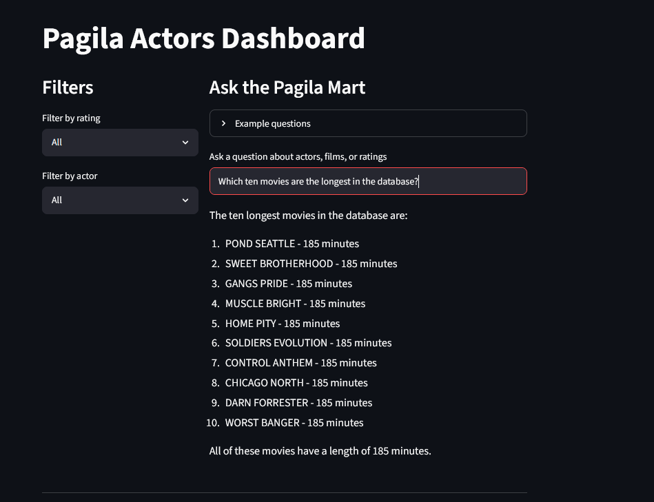
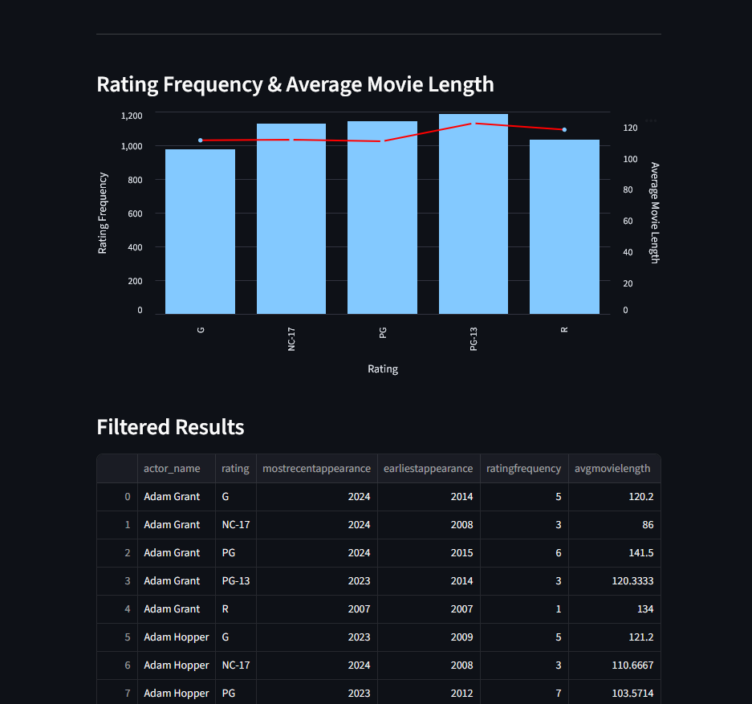
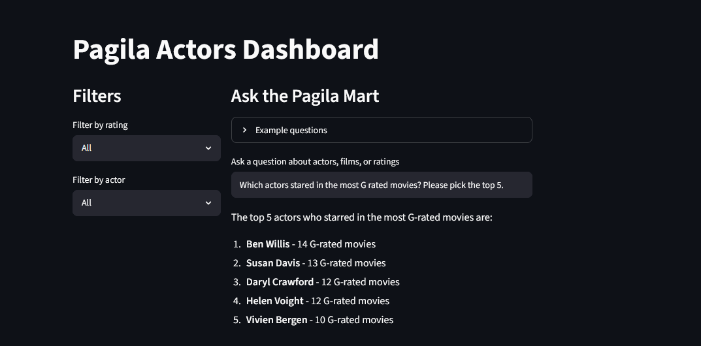

# Pagila Actors Dashboard

A Streamlit analytics dashboard for exploring actor, film, and rating data from a PostgreSQL Pagila mart. The app combines interactive filters, an Altair visualization, tabular results, and a LangChain-powered SQL agent that can answer natural-language questions against curated mart tables.

## Overview

This project is designed as a lightweight data application for analyzing the [Pagila PostgreSQL sample database](https://github.com/devrimgunduz/pagila) after it has been modeled into an `mrt` schema. Pagila is maintained by Devrim Gunduz and started as a PostgreSQL port of MySQL's Sakila example database. It currently focuses on actor-level film summaries, including film ratings, appearance dates, rating frequency, and average movie length.

The dashboard supports:

- Filtering actor summary data by film rating and actor name.
- Visualizing rating frequency alongside average movie length.
- Reviewing filtered mart records in an interactive Streamlit dataframe.
- Asking natural-language questions about actors, films, and ratings through an OpenAI-backed SQL agent.
- Managing supporting SQL scripts for mart tables, DML loads, views, and queries.

## Project Structure

```text
.
+-- app.py                         # Streamlit dashboard entry point
+-- agent.py                       # LangChain SQL agent configuration
+-- database.py                    # PostgreSQL connection and dataframe helper
+-- queries.py                     # Reusable SQL query definitions
+-- requirements.txt               # Python dependencies
+-- Images/                        # Dashboard/chart screenshots or exports
+-- PagilaSQL/
    +-- DML/                       # Mart load scripts
    +-- Queries/                   # Standalone analytical queries
    +-- Tables/                    # Mart table definitions
    +-- Views/                     # Mart view definitions
```

## Requirements

- Python 3.11 or newer recommended
- PostgreSQL with [Pagila](https://github.com/devrimgunduz/pagila) data available
- A configured `mrt` schema containing the expected mart objects
- OpenAI API key for the natural-language SQL agent

The app expects the following database objects to be available:

- `mrt.actor_movies_agg`
- `mrt.actors`
- `mrt.film_inventory`
- `mrt.film_actor`

## Environment Variables

Create a `.env` file in the project root with the following values:

```env
DB_HOST=localhost
DB_PORT=5432
DB_NAME=pagila
DB_USER=your_database_user
DB_PASSWORD=your_database_password
OPENAI_API_KEY=your_openai_api_key
```

The `.env` file is intentionally ignored by Git so local credentials are not committed.

## Installation

Create and activate a virtual environment:

```powershell
python -m venv env
.\env\Scripts\Activate.ps1
```

Install dependencies:

```powershell
pip install -r requirements.txt
```

## Database Setup

Before running the app, make sure your PostgreSQL database has the required Pagila mart schema and objects.

The `PagilaSQL` directory contains SQL assets that can be used to create and load the mart layer:

- `PagilaSQL/Tables/` contains table definitions.
- `PagilaSQL/DML/` contains load scripts.
- `PagilaSQL/Views/` contains view definitions.
- `PagilaSQL/Queries/` contains analysis queries.

Run these scripts in the order required by your local database setup. At minimum, the Streamlit dashboard requires `mrt.actor_movies_agg`, while the SQL agent uses the `mrt.actors`, `mrt.film_inventory`, and `mrt.film_actor` tables.

## Running the App

Start the Streamlit application:

```powershell
streamlit run app.py
```

Then open the local URL provided by Streamlit, typically:

```text
http://localhost:8501
```

## Using the Dashboard

Use the sidebar-style filter column to narrow results by:

- Film rating
- Actor name

Use the agent prompt to ask questions such as:

- Which actor appears in the most films?
- What are the top 10 longest PG films?
- List the films for Nick Wahlberg.
- Which ratings have the most films?
- What is the average movie length by rating?

The chart updates based on the selected filters, and the filtered dataframe provides the underlying records.

## Key Modules

### `app.py`

Defines the Streamlit interface, loads actor summary data, applies filters, renders the Altair chart, displays tabular results, and wires the natural-language question input to the Pagila SQL agent.

### `database.py`

Loads database credentials from `.env`, creates a PostgreSQL connection with `psycopg`, and exposes a helper for returning SQL query results as pandas dataframes.

### `queries.py`

Stores reusable SQL query strings used by the dashboard.

### `agent.py`

Builds a LangChain SQL agent using:

- `ChatOpenAI`
- `SQLDatabase`
- SQLAlchemy with the PostgreSQL `psycopg` driver
- The `mrt` schema search path

The agent is currently scoped to the mart tables needed for actor and film analysis.

## Example Dashboard Images

The `Images` directory includes example outputs from the dashboard:







## Development Notes

- Keep credentials in `.env` or Streamlit secrets, never in source files.
- Add new dashboard queries to `queries.py` rather than embedding SQL directly in `app.py`.
- Keep database access helpers in `database.py` so connection behavior stays centralized.
- If the mart schema changes, update both `queries.py` and the SQL agent table list in `agent.py`.
- Consider adding cached data loading with `st.cache_data` if the dataset or query latency grows.

## Data Source Attribution

This project uses the [Pagila PostgreSQL sample database](https://github.com/devrimgunduz/pagila) as its source dataset. Pagila is a PostgreSQL sample database maintained by Devrim Gunduz. According to the upstream project, Pagila began as a port of the Sakila example database for MySQL and is intended for use in examples, tutorials, articles, books, and sample applications.

Pagila is made available under the PostgreSQL License. See the upstream [devrimgunduz/pagila](https://github.com/devrimgunduz/pagila) repository for the original schema, data files, installation notes, and licensing details.

## Possible Next Iterations

- Add a setup script or migration runner for the `PagilaSQL` assets.
- Add Streamlit caching for repeated dashboard loads.
- Add tests for query construction and database helper behavior.
- Add error handling for missing environment variables or unavailable database connections.
- Add more dashboard tabs for films, inventory, rentals, and category-level analysis.
